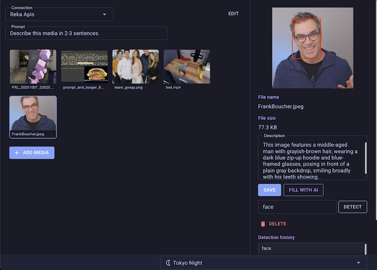
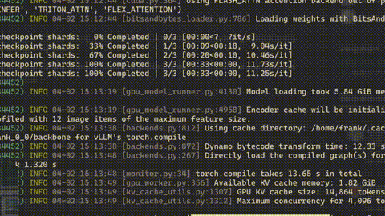

# Media Library

  [![Reka AI](https://img.shields.io/badge/Power%20By-2E2F2F?style=flat&logo=data%3Aimage%2Fsvg%2Bxml%3Bbase64%2CPD94bWwgdmVyc2lvbj0iMS4wIiBlbmNvZGluZz0iVVRGLTgiPz4KPHN2ZyBpZD0iTGF5ZXJfMSIgZGF0YS1uYW1lPSJMYXllciAxIiB4bWxucz0iaHR0cDovL3d3dy53My5vcmcvMjAwMC9zdmciIHZpZXdCb3g9IjAgMCA2NjYuOTQgNjgxLjI2Ij4KICA8ZGVmcz4KICAgIDxzdHlsZT4KICAgICAgLmNscy0xIHsKICAgICAgICBmaWxsOiBub25lOwogICAgICB9CgogICAgICAuY2xzLTIgewogICAgICAgIGZpbGw6ICNmMWVlZTc7CiAgICAgIH0KICAgIDwvc3R5bGU%2BCiAgPC9kZWZzPgogIDxyZWN0IGNsYXNzPSJjbHMtMSIgeD0iLS4yOSIgeT0iLS4xOSIgd2lkdGg9IjY2Ny4yMiIgaGVpZ2h0PSI2ODEuMzMiLz4KICA8Zz4KICAgIDxwYXRoIGNsYXNzPSJjbHMtMiIgZD0iTTMxOC4zNCwwTDgyLjY3LjE2QzM2Ljg1LjE5LS4yOSwzNy4zOC0uMjksODMuMjd2MjM1LjEyaDc0LjkzVjcxLjc1aDI0My43M1YwaC0uMDNaIi8%2BCiAgICA8cGF0aCBjbGFzcz0iY2xzLTIiIGQ9Ik03Mi45NywzNjIuOTdIMHYzMTguMTZoNzIuOTd2LTMxOC4xNloiLz4KICAgIDxwYXRoIGNsYXNzPSJjbHMtMiIgZD0iTTMxNS4zMywzNjIuODRoLTk5LjEzbC0xMDkuNSwxMDcuMjljLTEzLjk1LDEzLjY4LTIxLjgyLDMyLjM3LTIxLjgyLDUxLjkyczcuODYsMzguMjQsMjEuODIsNTEuOTJsMTA5LjUsMTA3LjI5aDEwMS42M2wtMTYyLjQ1LTE2MS43MiwxNTkuOTUtMTU2LjY3di0uMDNaIi8%2BCiAgICA8cGF0aCBjbGFzcz0iY2xzLTIiIGQ9Ik0zNDguNTksODIuOTJ2MTUyLjIzYzAsNDUuOTIsMzcuMTYsODMuMTEsODMuMDUsODMuMTFoMjMwLjI4di03MS43OGgtMjQwLjMzVjg1Ljg3YzAtNy43NCw2LjI4LTE0LjA2LDE0LjA1LTE0LjA2aDE0NC4zMmM3Ljc0LDAsMTQuMDUsNi4yOCwxNC4wNSwxNC4wNiwwLDUuOS0zLjcxLDExLjE3LTkuMjMsMTMuMmwtMTQ3LjQ1LDU2LjIzdjcwLjczbDE3NC41Ny02Mi4yYzMzLjA0LTExLjgsNTUuMTEtNDMuMTMsNTUuMTEtNzguMjZ2LTIuNjdDNjY3LDM3LDYyOS44LS4xOSw1ODMuOTUtLjE5aC0xNTIuMjdjLTQ1Ljg5LDAtODMuMDUsMzcuMTktODMuMDUsODMuMTFoLS4wM1oiLz4KICAgIDxwYXRoIGNsYXNzPSJjbHMtMiIgZD0iTTY2Ni45NCw1OTguMTJ2LTE1Mi4yM2MwLTQ1Ljg5LTM3LjE2LTgzLjExLTgzLjA1LTgzLjExaC0yMzAuMjh2NzEuNzhoMjQwLjMzdjE2MC42MWMwLDcuNzQtNi4yOCwxNC4wNi0xNC4wNSwxNC4wNmgtMTQ0LjMxYy03Ljc0LDAtMTQuMDUtNi4yOC0xNC4wNS0xNC4wNiwwLTUuOSwzLjcxLTExLjE3LDkuMjMtMTMuMmwxNDcuNDUtNTYuMjN2LTcwLjczbC0xNzQuNTcsNjIuMmMtMzMuMDQsMTEuOC01NS4xMSw0My4xMy01NS4xMSw3OC4yNnYyLjY3YzAsNDUuOTIsMzcuMTYsODMuMTEsODMuMDUsODMuMTFoMTUyLjI3YzQ1Ljg5LDAsODMuMDUtMzcuMTksODMuMDUtODMuMTFoLjAzWiIvPgogIDwvZz4KPC9zdmc%2B&logoSize=auto&labelColor=2E2F2F&color=F1EEE7)](https://reka.ai/)

A self-hosted web app for describing, and running AI object detection on your images and videos.

> **AI service**: any OpenAI-compatible API (local or cloud) — bring your own endpoint, key, and model.



## Run

```bash
docker compose up
```

or if you have .NET 10 installed:

```bash
dotnet run --project src/MediaLibrary
```

Open [http://localhost:8080](http://localhost:8080).
Media files and the database are persisted in a named volume (`media-data`) so they survive container restarts.

## How it works

See [docs/how-it-works.md](docs/how-it-works.md) for a full walkthrough of the app.

## Example / Tutorial

- Walkthrough / tutorial: [How to Serve a Vision AI Model Locally with vLLM and Reka Edge](https://dev.to/reka/how-to-serve-a-vision-ai-model-locally-with-vllm-and-reka-edge-5h2i)

- YouTube [video](https://www.youtube.com/watch?v=eyS_GWw-p54) [](https://www.youtube.com/watch?v=eyS_GWw-p54)

## Technologies

- .NET 10 / Blazor Server
- MudBlazor
- SQLite + Dapper
- FFmpeg (video thumbnails)
- Podman / Docker

## Contributing

1. Fork the repo and create a feature branch.
2. Keep changes focused — one concern per PR.
3. Open a pull request with a short description of what and why.

Issues and feedback are welcome.

## License

[MIT](LICENSE)
